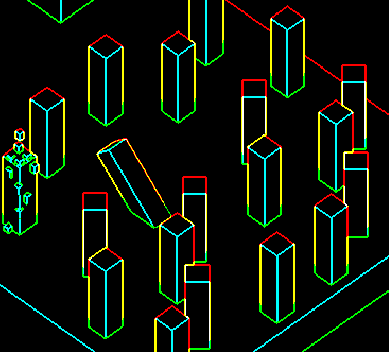

## Hello World!

I like making little play environments for myself in Unity as I learn. Currently I'm working on some cool custom unity render pipeline things :)

### Progress So Far
- Worked through most of catlikecoding's [Custom-SRP tutorials](https://catlikecoding.com/unity/tutorials/custom-srp/)
- Created my own lighting shaders following the inspiration of [t3ssel8r's popular videos](https://www.youtube.com/watch?v=0xJqzUHJ2fI&t=1s&ab_channel=t3ssel8r) (stylistic volumetric-esque lights that can be attached to particles)
- Converted SRP to use deferred shading techniques
- Added additional render passes to detect edges/convexity/outlines with some non-maxima suppression
- Feel free to check out my other toy projects as well :)

### Coming Soon 👀
- [ ]  Create some progress videos
- [ ]  Grass!
- [ ]  Proper shadows for particle lights
- [ ]  Attach custom render pipeline to other game projects of mine

### Progress Images

- Regular use case of particles

<picture>
  <source media="(prefers-color-scheme: dark)" srcset="images/SRP1.png">
  <source media="(prefers-color-scheme: light)" srcset="images/SRP1.png">
  
</picture>

- Extreme use case (still exceeds 100 FPS with over 1000 light particles)

<picture>
  <source media="(prefers-color-scheme: dark)" srcset="images/SRP2.png">
  <source media="(prefers-color-scheme: light)" srcset="images/SRP2.png">
  
</picture>

- Zoomed in view of shadowing and edge highlighting/outline darkening

<picture>
  <source media="(prefers-color-scheme: dark)" srcset="images/SRP3.png">
  <source media="(prefers-color-scheme: light)" srcset="images/SRP3.png">
  
</picture>

- Surface normal pass

<picture>
  <source media="(prefers-color-scheme: dark)" srcset="images/SRP4.png">
  <source media="(prefers-color-scheme: light)" srcset="images/SRP4.png">
  
</picture>

- World position pass

<picture>
  <source media="(prefers-color-scheme: dark)" srcset="images/SRP5.png">
  <source media="(prefers-color-scheme: light)" srcset="images/SRP5.png">
  
</picture>

- Edge detection/outline detection/convexity/non-maxima suppress pass

<picture>
  <source media="(prefers-color-scheme: dark)" srcset="images/SRP6.png">
  <source media="(prefers-color-scheme: light)" srcset="images/SRP6.png">
  
</picture>
