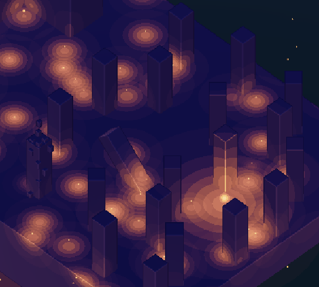
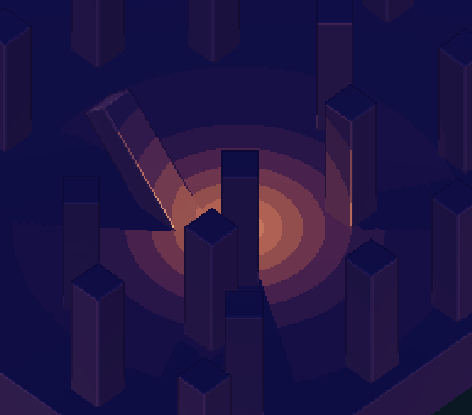
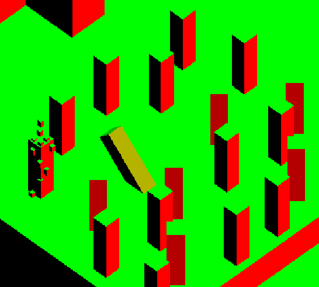

## Hello World!

I like making little play environments for myself in Unity as I learn. Currently, I'm working on some cool custom Unity render pipeline things :)

### Progress So Far
- Worked through most of catlikecoding's [Custom-SRP tutorials](https://catlikecoding.com/unity/tutorials/custom-srp/) to create my custom SRP 
- Created my own lighting particle shaders following the inspiration of [t3ssel8r's popular videos](https://www.youtube.com/watch?v=0xJqzUHJ2fI&t=1s&ab_channel=t3ssel8r) (stylistic volumetric-esque lights that can be attached to particles or game objects)
- Converted SRP to use deferred shading techniques
- Additional render passes to detect edges/convexity/outlines with some non-maxima suppression
- Water with adjustable reflectivity and refractions
- Interactable grass with adjustable wind effects
- Slow-rolling fog with adjustable parameters
- Custom pixel-snapping camera controller
- Custom ground-snapping player controller
- GPU Instanced projectiles
- Basic blender animations
- Feel free to check out my other toy projects as well :)

NOTE: SRP Pipeline project is not available on my GitHub at this time, if you need access please send me a message :)

### Coming Soon 👀
- [ ]  Create some progress videos

### Progress Images
NOTE: some artifacts seen are from gif file compression

- Transparent water with adjustable reflectivity and refractions

<picture>
  <source media="(prefers-color-scheme: dark)" srcset="images/Animation1.gif">
  <source media="(prefers-color-scheme: light)" srcset="images/Animation1.gif">
  
</picture>

- Interactable grass made with Procedural Rendering techniques and Compute Shaders

<picture>
  <source media="(prefers-color-scheme: dark)" srcset="images/Animation2.gif">
  <source media="(prefers-color-scheme: light)" srcset="images/Animation2.gif">
  
</picture>

- Slow-rolling fog and some initial animations

<picture>
  <source media="(prefers-color-scheme: dark)" srcset="images/Animation3.gif">
  <source media="(prefers-color-scheme: light)" srcset="images/Animation3.gif">
  
</picture>

- Ground snapping movement with pixel snapping camera to avoid aliasing for low-resolution games

<picture>
  <source media="(prefers-color-scheme: dark)" srcset="images/Animation4.gif">
  <source media="(prefers-color-scheme: light)" srcset="images/Animation4.gif">
  
</picture>

- GPU Instanced projectiles (easily maintains good performance with >1000 on-screen projectiles)

<picture>
  <source media="(prefers-color-scheme: dark)" srcset="images/Animation5.gif">
  <source media="(prefers-color-scheme: light)" srcset="images/Animation5.gif">
  
</picture>

- Regular use case of particles

<picture>
  <source media="(prefers-color-scheme: dark)" srcset="images/SRP1.png">
  <source media="(prefers-color-scheme: light)" srcset="images/SRP1.png">
  
</picture>

- Extreme use case (still exceeds 100 FPS with over 1000 light particles)

<picture>
  <source media="(prefers-color-scheme: dark)" srcset="images/SRP2.png">
  <source media="(prefers-color-scheme: light)" srcset="images/SRP2.png">
  
</picture>

- Zoomed in view of screenspace shadowing and pixel-wide edge highlighting/outline darkening

<picture>
  <source media="(prefers-color-scheme: dark)" srcset="images/SRP3.png">
  <source media="(prefers-color-scheme: light)" srcset="images/SRP3.png">
  
</picture>

#### Additional Passes

- Surface normal pass

<picture>
  <source media="(prefers-color-scheme: dark)" srcset="images/SRP4.png">
  <source media="(prefers-color-scheme: light)" srcset="images/SRP4.png">
  
</picture>

- World position pass

<picture>
  <source media="(prefers-color-scheme: dark)" srcset="images/SRP5.png">
  <source media="(prefers-color-scheme: light)" srcset="images/SRP5.png">
  
</picture>

- Edge detection/outline detection/convexity/non-maxima suppress pass

<picture>
  <source media="(prefers-color-scheme: dark)" srcset="images/SRP6.png">
  <source media="(prefers-color-scheme: light)" srcset="images/SRP6.png">
  
</picture>
